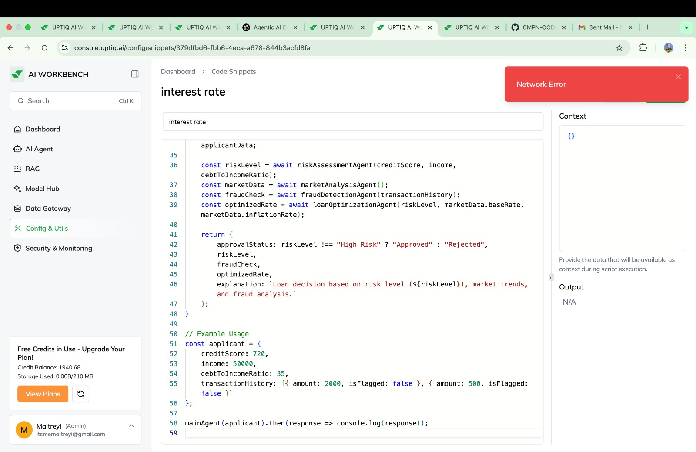

# Syrus Hackathon

## Topic: FinTech in Startups
# AI Loan Approval System

Solution implemented using [Uptiq AI](uptiq.ai).

## Project Overview
The **AI Loan Approval System** is designed to streamline loan approval processes using AI-driven assessment. This system calculates the probability of loan approval based on credit score estimation, leveraging **Retrieval-Augmented Generation (RAG)** for accurate decision-making.

## Team Information
- **Team Name**: CodeZilla  
- **Institute**: Vivekanand Education Society’s Institute of Technology  

## How It Works
1. **Sub-Agent Processing**: Dedicated AI agents calculate credit scores using a **vector RAG container**.
2. **Data-Driven Calculation**: The AI system determines the probability of loan acceptance based on financial data.
3. **Seamless API Integration**: Real-time loan estimation through **OpenAI 4o** and **Gemini 1.5 Flash**.

## Key Features
- **User-Friendly Input**: Intuitive interface for users to enter financial details.
- **RAG-Based Credit Scoring**: AI computes credit scores using Retrieval-Augmented Generation.
- **Loan Approval Probability Calculation**: AI determines approval likelihood based on credit score.
- **Clear Visualization**: Structured and visually appealing representation of results.

## Innovation (Showstopper)
Our **Credit Score RAG container** enables accurate credit scoring for laymen **without prior business knowledge**. This enhances accessibility and fairness in loan processing.

## Challenges Faced
During development, we encountered the following challenges:
1. **Agent Workflow Optimization**: Initially, we explored Chain-of-Thought (COT) reasoning but faced persistent errors.
2. **API Endpoint Search**: Difficulties in identifying suitable endpoints led to reworking the UI design.

## Future Objectives
- **Enhanced AI Decision-Making**: Improve accuracy using **ML models for risk assessment & fraud detection**.
- **Deeper API Integration**: Expand compatibility with multiple **fintech platforms**.
- **Adaptive Learning Mechanism**: Implement **continuous learning** for optimized loan approval processes.
- **Explainable AI (XAI) Implementation**: Provide **transparent justifications** for approval decisions.
- **Scalability & Global Expansion**: Adapt the system for **different financial regulations & international markets**.
- **User-Centric Enhancements**: Improve the **custom widget** for better interactivity.

## Challenges Faced

### 1. Editing Issues in JS Code  
We encountered persistent **network errors** when attempting to modify JavaScript code within the project files. This made it difficult to iterate on our initial approach, leading us to **scrap the chain-of-thought idea** for the project.  

### 2. API Limitations for Uptiq.ai  
Our original **UI design had to be abandoned** due to the unavailability of a public **API for Uptiq.ai**. Without a reliable API, integrating our frontend with the agent we were building became unfeasible, forcing us to reconsider our implementation strategy.

